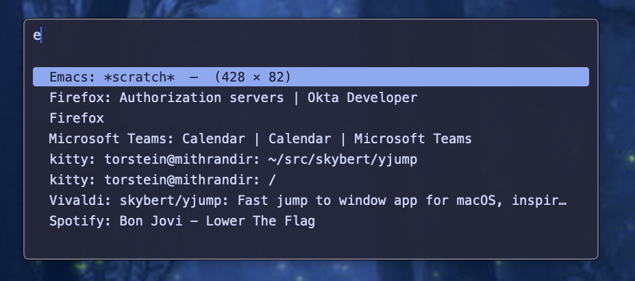

# yjump



A fast window switcher for macOS with fuzzy search, inspired by
[Rofi](https://github.com/davatorium/rofi) on Linux.

## Installation

```bash
$ git clone https://github.com/skybert/yjump.git
$ cd yjump
$ make install
```

## Bind yjump to a shortcut

macOS doesn't allow apps to register global shortcuts automatically. You
can add this yourself in a number of ways:

### Hammerspoon

Install [Hammerspoon](https://www.hammerspoon.org) and add to
`~/.hammerspoon/init.lua`:

```lua
hs.hotkey.bind({"shift", "ctrl"}, "o", function()
  hs.execute("open -a yjump")
end)
```

### Automator Service

Create a Quick Action in Automator that runs `open -a yjump`, then
assign it a keyboard shortcut in System Settings.

